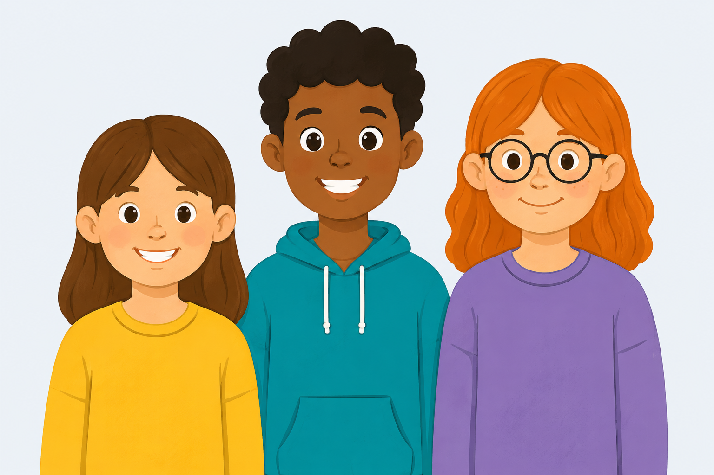

<!-- ==================== HERO SECTION ==================== -->

<!-- ==================== LEFT ==================== -->

<h1 style="
margin:0 0 22px;
font-size:2.1rem;
font-weight:700;
line-height:1.15;
color:#12346b;">

Improving Listening Environments for 
Neurodivergent People

</h1>

<a href="https://docs.google.com/forms/d/e/1FAIpQLSdP3h_uarIDNoNkd0FHKkyJCRcEI0Oj3-o8kw9r71HRKKfnRg/viewform?usp=sharing&ouid=106989043313353456488"
target="_blank"
style="
display:inline-block;
background:#079c9f;
color:white;
padding:14px 28px;
border-radius:10px;
text-decoration:none;
font-weight:700;
font-size:1rem;">
Register Adults 18+
</a>

<a href="https://docs.google.com/forms/d/e/1FAIpQLSd0ELz470lfPgW2tTmqMi3jN_kwTgZ168o9qkZhby9es32TbA/viewform?usp=sharing&ouid=106989043313353456488"
target="_blank"
style="
display:inline-block;
background:#079c9f;
color:white;
padding:14px 28px;
border-radius:10px;
text-decoration:none;
font-weight:700;
font-size:1rem;">
Register 7–18 years
</a>

<!-- ==================== RIGHT ==================== -->

<!-- ==================== WHY THIS RESEARCH? ==================== -->

  

    <h2>Why are we doing this?</h2>

    
Many neurodivergent children find it difficult to focus on speech in busy listening environments such as classrooms.

    
Our research uses child-friendly EEG to understand how the brain processes speech in these situations.

    
Our findings will help guide future listening technologies and environments that better support neurodivergent children at home and at school.

  

  

    

  

<!-- ==================== WHAT HAPPENS ON THE DAY? ==================== -->

<h2>What happens on the day?</h2>

  

    
    <h3>1. Welcome</h3>
    
Meet the research team at the Lloyd Institute, Trinity College.

  

  

    
    <h3>2. EEG Cap</h3>
    
Listen to short story clips with headphones and answer some simple questions.

  

  

    
    <h3>3. Listening</h3>
    
We will also record your heart with ECG sensors.

  

<!-- ==================== WHO CAN TAKE PART? ==================== -->

<h2 style="margin-top:0;">Who can take part?</h2>

<strong>Neurodivergent adults 18+ and children aged 7–18 years.</strong>

Child-friendly research at Trinity College Dublin. Participation is voluntary, and parents or carers are welcome throughout the visit.

<!-- ==================== FREQUENTLY ASKED QUESTIONS ==================== -->

<h2>Frequently Asked Questions</h2>

  
<strong>Does the EEG hurt?</strong>

  
No. EEG is completely painless and non-invasive.

  
<strong>Can parents stay during the visit?</strong>

  
Yes, parents or carers are welcome throughout the study visit.

  
<strong>Can my child stop at any time?</strong>

  
Yes. Participation is voluntary, and your child can stop at any stage.

  
<strong>How long does the study take?</strong>

  
The listening task takes around 20 minutes, with additional time for preparation.

  
<strong>Where does the study take place?</strong>

  
The Lloyd Institute, Trinity College Dublin. We will meet you in the lobby.

  
<strong>Is there parking?</strong>

  
Parking information will be provided before your visit.

<!-- ==================== MEET THE RESEARCH TEAM ==================== -->

<h2>Meet the Research Team</h2>

  

    

    <h3>Dr Giovanni Di Liberto</h3>
    
Principal Investigator

  

  

    

    <h3>Research Team</h3>
    
Friendly researchers who will guide your family throughout the visit.

  

<!-- ==================== CONTACT AND STUDY INFORMATION ==================== -->

<!-- CONTACT -->

<h2>Get in Touch</h2>

We would be delighted to answer any questions you may have about taking part.

<strong>Email:</strong> CHALEHCA@tcd.ie

<a href="mailto:CHALEHCA@tcd.ie"
style="background:#0077b6;
color:white;
padding:12px 22px;
border-radius:8px;
text-decoration:none;
font-weight:bold;
display:inline-block;
margin-top:10px;">
Email the Research Team
</a>

<!-- TRINITY IMAGE -->

<small>Study visits take place at Trinity College Dublin.</small>

<!-- PARTICIPANT INFORMATION -->

<a href="{{ '/Participant-Information-Sheet.pdf' | relative_url }}"
style="background:#28a745;
color:white;
padding:16px 24px;
border-radius:10px;
text-decoration:none;
font-weight:bold;
display:inline-block;">
📄 Download Participant Information Sheet
</a>

<small>Read the full study information before deciding whether to take part.</small>

<!-- ==================== ETHICS FOOTER ==================== -->

  This study has received ethical approval from the Trinity College Dublin Research Ethics Committee. Participation is voluntary, and you may withdraw from the study at any time without giving a reason.

